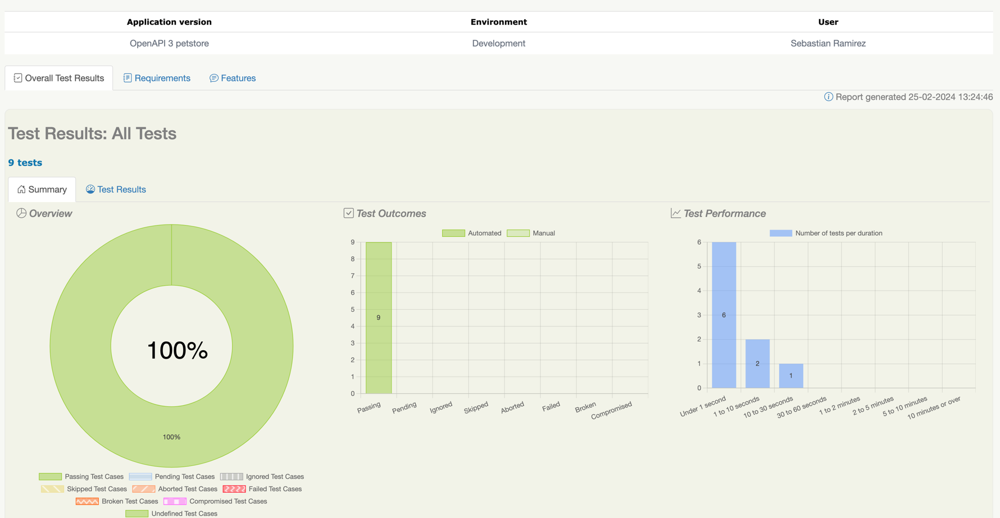
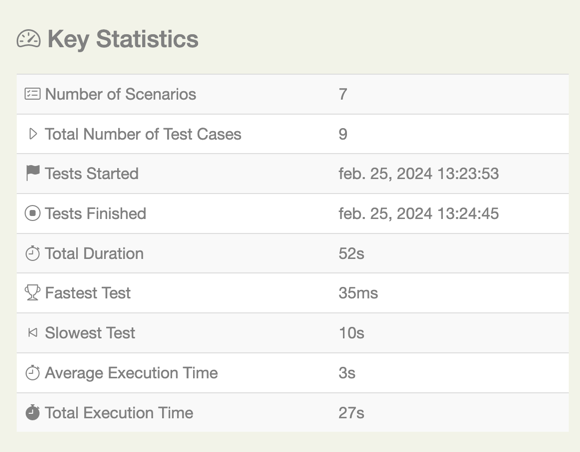
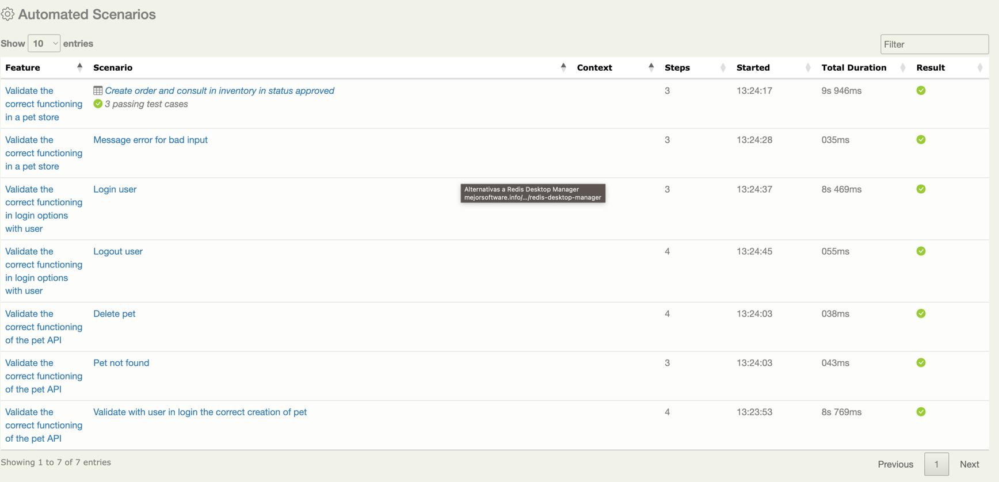
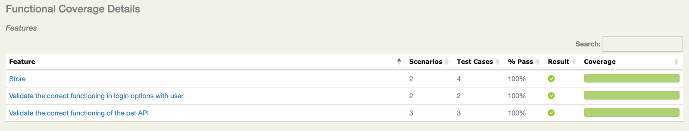

# **Home Challenge Automation Visa**

## Introduction 🚀

Automation project made for Visa.
In this document you can find everything related to the project carried out in Serenity BDD for APIS testing.

## Preconditions 📋

---
- Java v17
- Gradle v8.2
- IntelliJ IDEA with plugins:
    + ```Cucumber```
    + ```Gherkin```
    + ```Kotlin```
- Environment variables
    + Gradle → ```GRADLE_HOME```
    + JDK → ```JAVA_HOME```
## Built with 🛠

---
- **Kotlin** - Programming language
- **BDD** - Development strategy
- **Screenplay** - Design pattern
- **Gherkin** - DSL to write requirements
- **Gradle** - Dependency manager
- **Cucumber** - Tool to automate using BDD
- **Serenity BDD** - Automation framework & report generation
- **RestAssured** - Library to consume microservices

## Consider 🕵️

``` 
- Local considerations
 1. Configure enviroment variables
 2. Execute Swagger Project Pet Store with Docker
 3. Remember that the serenity report is created in the target folder. Open the index.html to look at the report.
  
```

## Test Cases 🐛

**Test case name**: Validate correct creation of pet with user logged in during login

**Test case ID**: PT1

**Description**: This test aims to verify the integration of the user when creating a pet and subsequently querying it after its creation.
Test Data:

curl -X 'POST' \
'http://localhost:8080/api/v3/pet' \
-H 'accept: application/xml' \
-H 'Content-Type: application/json' \
-d '{
"id": 10,
"name": "doggie",
"category": {
"id": 1,
"name": "Dogs"
},
"photoUrls": [
"string"
],
"tags": [
{
"id": 0,
"name": "string"
}
],
"status": "available"
}'

**Steps to execute**:

1. Login with a pre-existing user.
2. Create a pet in the store.
3. Query the pet previously created by its ID.

**Expected result**: The information of the newly created pet should be identical to the pet queried by the same ID.

------
**Test case name**: Delete pet

**Test case ID**: PT2

**Description**: This test aims to verify that a pet created in the store can be deleted using its ID.
**Test Data**:

curl -X 'DELETE' \
'http://localhost:8080/api/v3/pet/12' \
-H 'accept: */*'

**Steps to execute**:

1. Log in with a pre-existing user.
2. Create a pet in the store.
3. Delete the pet previously created by its ID.

**Expected result**: The pet should be successfully deleted. A message confirming successful deletion should be received.

------
**Test case name**: Pet not found

**Test case ID**: PT3

**Description**: This test aims to verify that when sending a non-existent or invalid ID, the service responds with the appropriate error message.

**Test Data**:

curl -X 'GET' \
'http://localhost:8080/api/v3/pet/100000' \
-H 'accept: application/xml'

**Steps to execute**:

1. Log in with a pre-existing user.
2. The user enters a non-existent or invalid ID.

**Expected result**: The service should return an error response as the ID does not exist. The message should be "Pet not found".

------

**Test case name**: Create order and check inventory status for approval

**Test case ID**: ST1

**Description**: The aim is to validate that when placing a new order with any status, the inventory count for that status increases.

**Test Data**:

curl -X 'GET' \
'http://localhost:8080/api/v3/store/inventory' \
-H 'accept: application/json'

curl -X 'POST' \
'http://localhost:8080/api/v3/store/order' \
-H 'accept: application/json' \
-H 'Content-Type: application/json' \
-d '{
"id": 10,
"petId": 198772,
"quantity": 7,
"shipDate": "2024-02-25T17:16:50.788Z",
"status": "approved",
"complete": true
}'

**Steps to execute**:

1. Check the inventory before executing the order.
2. Place the order with three different existing statuses.
3. Recheck the inventory.

**Expected result**: Upon rechecking the inventory after placing the order with the corresponding status, it should increase.

------

**Test case name**: Message error for bad input

**Test case ID**: ST2

**Description**: The objective is to validate that when providing incorrect input in the store order API, it returns a 405 status code with its respective message.

**Test Data**: 

curl --location --request PUT 'http://localhost:8080/api/v3/store/order' \
--header 'accept: application/json' \
--header 'Content-Type: application/json' \
--data-raw '{
"id": 10,
"petId": 198772,
"quantity": 7,
"shipDate": "2024-02-25T17:16:50.788Z",
"status": "approved",
"complete": true
}'

**Steps to execute**:

1. Log in with an existing user.
2. Execute the store order endpoint with bad input.

**Expected result**: The message "HTTP 405 Method Not Allowed" should be displayed.

------

**Test case name**: Login user

**Test case ID**: US1

**Description**: The aim is to test the login functionality of a newly registered user

**Test Data**:

curl -X 'POST' \
'http://localhost:8080/api/v3/user' \
-H 'accept: application/json' \
-H 'Content-Type: application/json' \
-d '{
"id": 10,
"username": "theUser",
"firstName": "John",
"lastName": "James",
"email": "john@email.com",
"password": "12345",
"phone": "12345",
"userStatus": 1
}'

curl -X 'GET' \
'http://localhost:8080/api/v3/user/login?username=Sebas2&password=123456' \
-H 'accept: application/xml'

**Steps to execute**:

1. Create a user.
2. Enter the credentials of the newly created user.

**Expected result**: The message "Logged in user session" should be displayed upon successful login.

------

**Test case**: Logout user

**Test case ID**: US2

**Description**: The objective is to test the logout functionality of a newly registered user.

**Test Data**: 

curl -X 'GET' \
'http://localhost:8080/api/v3/user/logout' \
-H 'accept: */*'

**Steps to execute**:

1. Create a user.
2. Enter the credentials of the new user.
3. Logout.

**Expected result**: The message "User logged out" should be displayed.

------

## Results 📑



Nine tests are executed with a 100% success rate, encompassing both critical and negative cases. In the graph, it is evident that six tests yielded a response time of less than 1 second, two tests fell within the range of 1 to 10 seconds, and one test took between 10 to 30 seconds to complete

In the following graph, we can observe that the total duration of all tests was 27s. The fastest one took 35ms, while the slowest took 10s. This indicates that the majority of APIs (6 APIs) responded quickly, whereas the remaining APIs (3 APIs) took more than 1s to respond.



Duration of each scenario:


In this graph, it is demonstrated that the scenarios that took the longest to execute were: Creating an order and checking its status in the store, Creating a user and logging in, and the correct creation of the pet

Below is the test coverage:


Conclusion:

In conclusion, a proper functioning of the APIs is demonstrated as they return the expected responses with the corresponding data.

It is also demonstrated that by correlating the operation of the APIs with each other, they integrate correctly. This allows for end-to-end flows with them.

Throughout several executions, it is evident that the environment is somewhat unstable due to the fact that the APIs sometimes did not respond due to server errors. (This occurred more frequently locally, with many of them being resolved with the Docker image).


## Project Structure 🚧

* ```src/main/kotlin/com/home/challenge/visa```
``` 
+ models
    They are classes with which we build our data models, such as JSON schemas.

+ questions
    They are dedicated classes to perform validations of a set of specific expected results, when using Hard Asserts the class will always return true. Implements Performable so you can use the created actor.
    In the questions, the ensure "That" construct was used. It's important to remember that even though the ensure clause in the question class always returns true, if the assert statement is incorrect, it never reaches this return.

+ tasks
    These are classes that perform high-level actions. Implements Performable so you can use the created actor.

+ userinterface
    They are classes where the user interface elements such as text fields, buttons, copies, labels, etc. are mapped. In this case it does not apply because it is a purely APIS exercise.

+ utils
    They are classes that contain common functionalities, such as constants, utilities for working with dates, utilities for JSONS files, Serenity Sessions, etc.
```

* ```src/test/kotlin/com/home/challenge/visa```
```
+ runners
    They are classes that represent the starting point to execute the scenarios, each class in this package is associated with a .feature file and with a class from the stepdefinitions package.

+ stepdefinitions
    They are classes where the steps of the scenario written in gherkin are defined and connected with cucumber to translate them into the programming language. It also contains the classes that execute the @Before and @After methods which are in the hooks folder.
 ```

* ```src/test/resources/features```
```
+ features
    It is the folder where the .feature files are located, which are responsible for containing the scenarios written in gherkin. For each feature there must be a runner and stepdefinition class.
```

## Report 📑

---
At the end of the execution of the tests, the aggregate is performed and the following report is generated:

**Serenity reports** ```target/site/serenity/index.html```

## VCS 🔀

---
Git is used as a version control system.

## Contributor

**Sebastian Ramirez** - [Contact](mailto:sebastianramirez.g@outlook.com)

---
