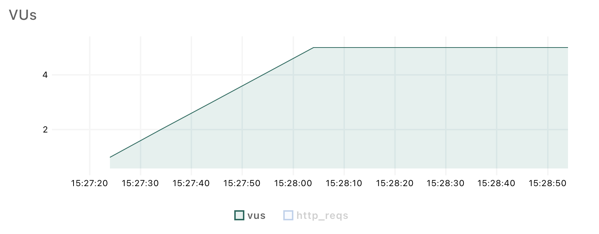

# **Home Challenge Performance Visa**

## Introduction 🚀

This document will display, explain, and draw conclusions about the results of each type of test performed on the different PetStore APIs with K6 for performance testing.

---

## Tests carried out 🐛

Performance tests were conducted on the following APIs:

- **User**: User creation and login.
- **Pet**: Pet creation in store.
- **Store**: Inventory query.

---

## Project Structure 🚧

* ```api```
```
+ load-test
    They are load test Js.

+ smoke-test
    They are smoke test Js.

+ stress-test
    They are stress test Js.
```
 ---

**Smoke Test**

- **User**:

In this smoke test, we aim to demonstrate how the user creation API behaves with only 1 virtual user (VU), sending one request per second.


In these results, we can primarily observe that 15% of the transactions successfully responded with a 200 status code. The remaining 85% responded with errors. This means that the majority of transactions took more than 1 second to respond. Out of a total of 60 transactions, only 9 were successful.


We can also observe that according to the p95, 95% of the transactions took less than one second to respond.

- **Pet**: 

In this smoke test, we aim to demonstrate how the "create pet in store" API behaves with only 1 virtual user (VU), sending one request per second.


In these results, we can observe that 100% of the transactions responded with a status 200. All 60 transactions were successful. The API successfully responded to 60 transactions in 1 minute, made by 1 VU.


It is evident that there were no errors.


We can also observe that the duration of the requests, according to the p99, was less than 1 second, which means it has a good response time.

- **Store**:

In this smoke test, we aim to demonstrate how the "inventory query in the store" API behaves with 2 virtual users (VUs), sending 2 requests per second.


In these results, we can observe that 100% of the transactions responded correctly with a status 200. The 120 transactions made by the 2 VUs were successful. The API successfully responds to 120 transactions in 1 minute.


It is evident that there were no errors.


We can observe that the duration of each of the 120 transactions performed during the smoke test was less than 1 second. This indicates that it is an optimal and efficient time.

**Conclusions and Recommendations on Smoke Test Analysis:**


The smoke tests proved effective in quickly identifying any critical issues with the APIs under test. For the "Inventory in store" and "Pet creation" APIs, all transactions responded with a status 200, indicating that no critical errors were encountered during the tests.

However, for the "User creation" API, it was found that after approximately 9 seconds, the API started to throw errors. This indicates that this API has a critical error as per the test plan. It is considered that the API has a slow response time.

In terms of performance, the performance of the "Inventory in store" and "Pet Creation" APIs during the smoke tests was satisfactory, with all transactions completing successfully within an optimal time frame of less than 1 second.

However, for the "User creation" API, it was overwhelmed by throwing 1 request per second.

Furthermore, the stability of the "Inventory in store" and "Pet Creation" APIs was demonstrated by the absence of errors and the consistent response time across all transactions. This indicates that the APIs are reliable and capable of handling the expected load.

Regarding the "User creation" API, the lack of scalability is noted as it demonstrated a large number of errors during the smoke test. Only 9 out of 60 transactions were successful.

**Recommendations**:

Based on the results of the smoke test, it is recommended to optimize the "User creation" API as it easily becomes overwhelmed and starts returning a status 500, preventing its correct functioning.

It is recommended to improve the API like "Pet creation" since both receive a list, but it is evident that the "User creation" API is not equally optimized.

In conclusion, it is found that the "Inventory in store" and "Pet Creation" APIs are in an optimal state for basic use.

---

**Load Test**

- **User**:

In this load test, the goal is to observe the behavior of the "User Create" API under specific load conditions over 3 time intervals, sending one transaction every 30 seconds.


We can observe that a total of 17 transactions were performed. Each transaction was executed every 30 seconds with an increase in virtual users (VUs). It can be seen that failures began from the second execution. This demonstrates once again a lack of optimization in the "User Create" API.

We can also observe the instability in terms of response times. The peaks increase at certain intervals, although the response time still remains less than 1 second.


On the other hand, we observed a period during which the server stopped responding between 10:48:00 and 10:48:20. Therefore, we can say that the server was down without response for 20 seconds.

- **Pet**:

In this load test, the goal is to observe the behavior of the "Pet Create" API under specific load conditions over 3 time intervals, sending one transaction every 5 seconds.




The results show that 88 successful transactions were performed with a maximum of 5 virtual users (VUs).


In the graph, it can be observed that the waiting time is at a p99 of 7ms, which is less than a second, thus meeting the expected performance.

- **Store**:

In this load test, the goal is to observe the behavior of the "Inventory in Store" API under specific load conditions over 3 time intervals, sending one transaction every 5 seconds.


In the graph, we can observe that 100% of transactions were successfully completed. A total of 88 transactions were executed, with each transaction occurring every 5 seconds, while increasing the number of virtual users (VUs).


In the graph, we can observe that all transactions took less than 1 second to complete.

**Conclusions and Recommendations on Load Test Analysis:**

Based on the tests conducted, it is evident that the "Inventory in Store" and "Pet Creation" APIs exhibit good responsiveness, indicating their capability to handle a substantial load effectively.

However, the "User Creation" API struggles to handle transactional load even at intervals of every 30 seconds, highlighting its poor optimization.

**Recommendations**:

Implement in "User Creation" API measures to mitigate server unresponsiveness, such as enhancing server capacity or optimizing code execution.
---

**Stress Test**
    
- **User**:

In this stress test, we aim to demonstrate the behavior of the "Login" API when multiple transactions are injected into it and the number of virtual users (VUs) is increased at regular intervals.


In these results, we can observe that 100% of transactions responded correctly. That is, all 2899 transactions sent to the "Login" API show no errors or failures. It demonstrates that the API responds very optimally under a large number of transactions.


The test behavior is also observed in the graph as the stress test increases transactions and VUs per second. It reaches a point where it remains constant for 5 minutes and then decreases again to assess the behavior of this API. The proper functioning of the API under this stress test is observed.


It is also evident that the data sent is less than the data received.


In this graph, we observe that between 10:06 and 10:09, there are higher peaks in request and response duration for the request. If we analyze this point, it is precisely when the number of VUs starts to increase before reaching the maximum and stabilizing. This means that the performance of the API decreases slightly as the number of VUs increases significantly, which would be between 16 and 27 VUs.

- **Store**:

In this stress test, we aim to demonstrate the performance of the "Inventory in Store" API when multiple transactions are injected into it and the number of virtual users (VUs) increases at certain intervals of time.


In these results, we can observe that 100% of transactions responded correctly. That is, all 2899 transactions sent to the "Inventory in store" API show no errors or failures. It demonstrates that the API responds very optimally under a large number of transactions.


In this graph, we can observe the behavior of the test where the number of virtual users (VUs) gradually increases until reaching a stable point, and then decreases again. As the VUs increase, the number of transactions also increases.


In the request duration graph, we can observe that the duration of the request and response for the "Inventory in Store" API is very stable. There are no significant peaks of delay in the request.

**Conclusions and Recommendations on Stress Test Analysis:**

The stress test effectively evaluated the performance of the "Inventory in Store" and "Login" APIs under increasing loads and varying numbers of virtual users (VUs).

The APIs demonstrated stability and consistent response times throughout the test, with no significant delays or performance bottlenecks observed.

As the number of virtual users increased, the number of transactions also increased, indicating that the API could handle higher loads effectively.

**Recommendations**:

Based on the stable performance observed during the stress test, it is recommended to continue monitoring the API's performance under even higher loads to ensure scalability.

Based on the peaks observed in the "Login" API, it is recommended to pay closer attention to that range where the number of users increases. However, this should not hinder the proper functioning of the API.

Overall, the stress test provided valuable insights into the performance and scalability of the "Inventory in Store" and "Login" API, helping to ensure its reliability and readiness for production use.

---
**General Recommendations**

Considering that the test was not conducted in a real production environment, it is important to take into account the machine's capacity to process requests, including CPU, memory, network resources, virtualization resources, cache resources, among other resources.

---

## Contributor
* **Sebastian Ramirez** - [Contact](mailto:sebastianramirez.g@outlook.com)

---