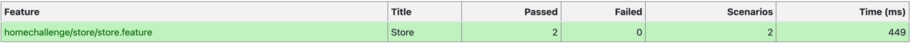
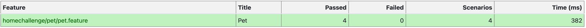

# **Home Challenge Automation Visa**

---

## Introduction 🚀

Automation project in Karate made for Visa.
In this document, you will find the smoke test conducted with Karate to verify the minimum correct functionality of various pet store APIs.


---

## Execution 

---

To execute the project, each corresponding runner for each feature must be executed.

---

## Preconditions 📋

---
- Java v17
- Maven
- IntelliJ IDEA with plugins:
    + ```Cucumber```
    + ```Gherkin```
- Environment variables
    + JDK → ```JAVA_HOME```
  
---

## Test results





With the previous results, it is confirmed that the Smoke Test executed correctly. The minimum functionality of the automated APIs is ensured.

---

## Project Structure 🚧

* ```src/test/java/homechallenge/*```
```
+ runners
    They are classes that represent the starting point to execute the scenarios, each class in this package is associated with a .feature file and with a class from the stepdefinitions package.
+ features
    It is the folder where the .feature files are located, which are responsible for containing the scenarios written in gherkin. For each feature there must be a runner.
 ```
---

## Contributor

**Sebastian Ramirez** - [Contact](mailto:sebastianramirez.g@outlook.com)

---